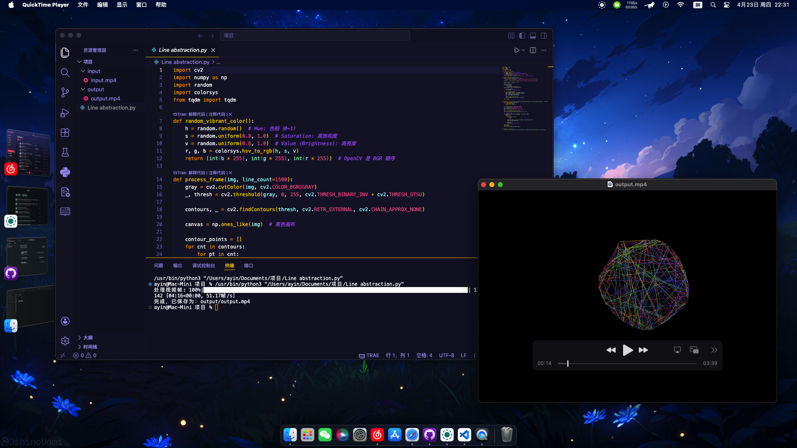

# Line Abstraction Video Processor

An OpenCV-based video processing tool that converts input videos into line abstract art effects.

## 📹 Demo



## ✨ Features

- Extract object outlines from videos
- Redraw with randomly colored lines on a black background
- Generate artistic line abstract videos
- Support customizing the number of lines to adjust visual effects
- Include progress bar to display processing status


## 🔧 How It Works

1. Read each frame of the input video
2. Convert image to grayscale
3. Apply binary threshold processing (OTSU algorithm)
4. Extract external contour points from the image
5. Randomly draw colored lines between contour points
6. Write processed frames to output video

## 📁 File Structure

```
project/
├── Line abstraction.py    # Main program file
├── input/                 # Input video directory
│   └── input.mp4          # Sample input video
├── output/                # Output video directory
├── demo.png               # Demo image
└── README.md              # Project documentation
```

## 🚀 Usage

### Install Dependencies

Make sure to install the required libraries:

```bash
pip3 install opencv-python numpy tqdm
```

### Running the Program

1. Put the video file to be processed into the `input/` directory, named `input.mp4`
2. Run the main program:

```bash
python3 "Line-abstraction.py"
```

3. After processing, the result video will be saved in the `output/` directory, named `output.mp4`

## ⚙️ Parameter Configuration

- `line_count`: Controls the number of lines drawn per frame, default is 200
- Line density can be adjusted by modifying parameters in the main function

## 🎨 Customization

You can modify the following parameters to customize the output effect:

- `line_count`: Number of lines, affecting frame complexity
- Color generation algorithm: Can adjust color range and saturation
